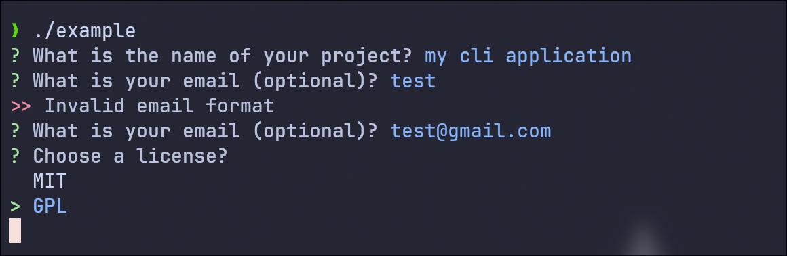
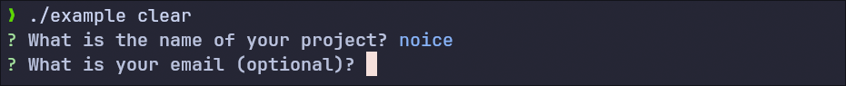
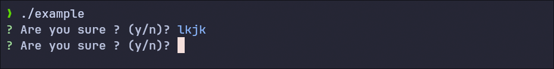
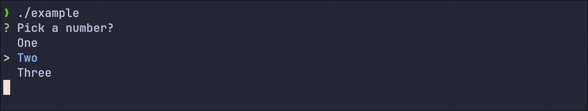
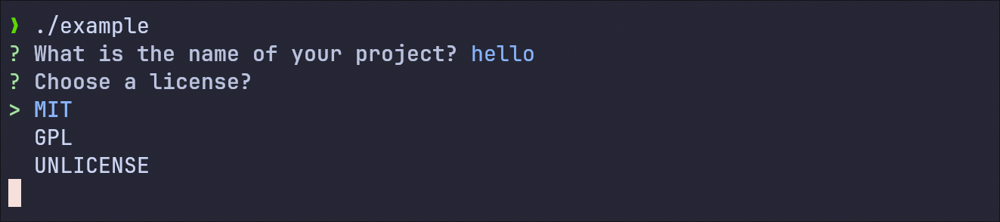
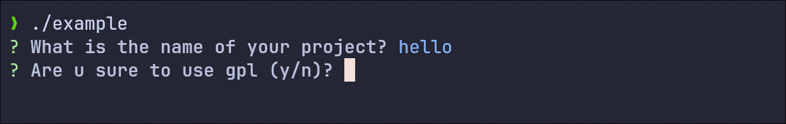

Project generated with [Templi](https://github.com/RickaPrincy/Templi)

#  :memo: cpp_inquirer

A lightweight, extensible C++ library that interactively collects user input through a friendly prompt system inspired by [Inquirer.js](https://github.com/SBoudrias/Inquirer.js).



## Table of Contents

- [Features](#features)
- [Installation](#installation)
- [Getting Started](#getting-started)
	- [Text question](#text_question)
	- [Boolean question](#boolean_question)
	- [Select question](#select_question)
	- [Inquirer Class](#inquirer-class)
- [Validators](#validators)
	- [How to use ?](#how-to-use-)
	- [Validator Behavior](#validator-behavior)
	- [Built-in Validators](#built-in-validators)
	- [Custom Validators](#custom-validators)
- [When Callbacks](#when-callback)
	- [Usage](#usage)
	- [Built-in Callback](#built-in-callback)
- [License](#license)

## Features

- Simple and expressive syntax for defining interactive prompts
- Supports different question types: `text`, `boolean`, `select`
- Custom validation and built-in validation system (`required`, `email`, `max_length`, etc.)
- Conditional logic using when callbacks with some built-in callbacks
- Easy integration with any C++ project

## Installation

- Archlinux

```bash
yay -Sy cpp_inquirer 
```
### Another system (not archlinux)

- Dependancies
    - CMake (Version 3.18 or later)
    - C++ Compiler with C++17 support

#### Option 1 — Add cpp_inquirer as submodule (recommended)

```bash
git submodule add https://github.com/RickaPrincy/cpp_inquirer.git external/cpp_inquirer

git submodule update --init --recursive
```

```cmake
# In your CMakeLists.txt
add_subdirectory(external/cpp_inquirer)
target_link_libraries(your_target PRIVATE cpp_inquirer)
```

#### Option 2 — Build and then link the library with your project

- Build and then link the library with your project it 

Example of how to build:
```bash
git clone -b v0.0.1 https://github.com/RickaPrincy/cpp_inquirer 

cd cpp_inquirer 

mkdir build

cd build

cmake -DCMAKE_BUILD_TYPE=Release -S .. -B .

# For shared library
# cmake -DBUILD_SHARED_LIBS=ON -DCMAKE_BUILD_TYPE=Release -S .. -B .

sudo make #build/lib/
# sudo make install
```
#### :warning: If some libs are not found after building manually

Identify the installation path of the missing library. For example, let's assume the library is installed in `/usr/local/lib` (on linux it should be there).

If you are using Linux, add the following code to your `~/.zshrc` or `~/.bashrc` based on what you use (replacing `/usr/local/lib` with the actual installation path):

```bash
export LD_LIBRARY_PATH=/usr/local/lib:\$LD_LIBRARY_PATH
```

## Getting Started

The first thing to note is that **all output from all prompts will be a string**.  

However, you can add a validator (e.g., `validator_factory::number()`) to force the user to enter a number, for example.  
You can then convert the user input into a number using `evaluate::as_int()` or your own method.

See more about how to validate user input in the [Validators](#validators) section.

### `text_question`

`text_question` allows you to retrieve any input from the user. 



```c++
#include <cpp_inquirer/cpp_inquirer.hpp>

using namespace cpp_inquirer;

auto main(int argc, char *argv[]) -> int
{
	auto question1 = text_question("project_name", "What is your projet_name");
	auto answer = question1.prompt();

	// Using builder
	auto question2 = question::builder()
						 .name("email")
						 .label("What is your email")
						 .type(question_type::text)
						 .build();
	auto answer2 = question2->prompt();

	// Prompt directly
	auto answer3 = text_question::prompt("What is your project_name");

	return 0;
}
```

### `boolean_question`
`boolean_question` allows you to ask yes/no (true/false) style questions. When the user enter a non valid input (y/n), this will prompt the user again.

The output will be `"true"` or `"false"` as a string.



```c++
#include <cpp_inquirer/cpp_inquirer.hpp>

using namespace cpp_inquirer;

auto main(int argc, char *argv[]) -> int
{
	auto question1 = boolean_question("confirm", "Are u sure");
	auto answer = question1.prompt();

	// Using builder
	auto question2 = question::builder()
						 .name("confirm")
						 .label("Are u sure")
						 .type(question_type::boolean)
						 .build();
	auto answer2 = question2->prompt();

	// Prompt directly
	auto answer3 = boolean_question::prompt("Are u sure");

	return 0;
}
```

### `select_question`
`select_question` allows you to present a list of choices to the user. 

Each choice is defined using a `pair_of_string`, which is simply an alias for `std::pair<std::string, std::string>`. The first element of the pair is the internal value (name), and the second is the display label shown to the user.

The output of a select_question is the `name` of the selected choice.



```c++
#include <cpp_inquirer/cpp_inquirer.hpp>
#include <iostream>

using namespace cpp_inquirer;

auto main(int argc, char *argv[]) -> int
{
	auto question1 = select_question("number", "Pick ` number", {{"1", "One"}, {"2", "Two"}});
	auto answer1 = question1.prompt();

	// Using the builder
	auto question2 = question::builder()
						.name("license")
						.label("Choose a license")
						.type(question_type::select)
						.options({ { "mit", "MIT" }, { "gpl", "GPL" }, { "apache", "Apache 2.0" } })
						.build();
	auto answer2 = question2->prompt();

	// Prompt directly
	auto answer3 = select_question::prompt(
		"Pick a number", 
		{ { "1", "One" }, { "2", "Two" }, { "3", "Three" } });
	return 0;
}
```

### `inquirer class`
`inquirer` class allows you to group multiple questions and prompt them all at once. 

You can also make some inputs conditional based on the values of previous answers.




```c++
#include <cpp_inquirer/cpp_inquirer.hpp>
#include <iostream>

using namespace cpp_inquirer;

auto main(int argc, char *argv[]) -> int
{
	inquirer q;
	q.add(question::builder()
			  .name("project_name")
			  .label("What is the name of your project")
			  .type(question_type::text)
			  .build())
		.add(question::builder()
				.name("license")
				.label("Choose a license")
				.type(question_type::select)
				.options({ { "mit", "MIT" }, { "gpl", "GPL" }, {"unlicense", "UNLICENSE"} })
				.build())
		.add(question::builder()
				.name("confirm_gpl")
				.label("Are u sure to use gpl")
				.type(question_type::boolean)
				.when(callback::is_one_of("license", { "gpl", "unlicense" }))
				.build());

	auto inquirer_answers = q.prompt(); // std::map<std::string, std::string>
	for (const auto &[name, answer] : inquirer_answers)
	{
		std::cout << name << " -> " << answer << "\n";
	}

	return 0;
}
```

See more predefined `when_callback`s or how to create custom ones in the [When Callback](#when-callback) section.

## Validators

> **Note:** Only `text_question` and certain utility functions like `prompt(...)` support validators.  
> Other question types (e.g., `select`, `boolean`) ignore validator logic.

Validators allow you to enforce constraints on user input, such as requiring a value, checking for length, verifying formatting, and more.

#### How to Use ?

You can attach one or more validators directly to a `text_question`, or pass them to helper functions like `prompt(...)`.

##### With `text_question`:

```cpp
.add(question::builder()
    .name("email")
    .label("What is your email (optional)")
    .type(question_type::text)
    .validators({
        validator_factory::optional(),
        validator_factory::email()
    })
    .build())
```

The question stores its validators internally:

```c++
std::vector<std::shared_ptr<validator>> m_validators{};
```

##### With prompt(...) helper:
```c++
auto email = prompt("Enter your email", {
    validator_factory::required(),
    validator_factory::email()
});
```

#### Validator Behavior

If multiple validators are provided:

- They are evaluated in order.

- If one fails, the input is rejected and the error message is shown.

- If a validator has `skip_next_validators_if_match = true` and it passes, all following validators are skipped. This is useful for example for the `optional` fields, where you want to skip other checks if the input is empty.

Example:
```c++
.validators({
    validator_factory::optional(),      // If input is empty → skip next
    validator_factory::email()          // Only applies if something was typed
})
```
#### Built-in Validators

```cpp
validator_factory::optional()
validator_factory::required("You must provide a value")
validator_factory::min_length(5, "Must be at least 5 characters long")
validator_factory::max_length(20, "Must be no longer than 20 characters")
validator_factory::number()
validator_factory::floating()
validator_factory::lowercase()
validator_factory::uppercase()
validator_factory::email()
```

#### Custom Validators

Besides using `validator_factory::make(...)` with a regular expression, you can also **create fully custom validators** by extending the `validator` class.

##### Option 1: Using `make(...)`

Create a validator using a regular expression:

```cpp
validator_factory::make(
    std::string pattern,
    std::string message = "",
    bool skip_next_validators_if_match = false
)
```

Examples:
```c++
validator_factory::make("^[0-9]{3}$", "Must be a 3-digit code")
validator_factory::make("^[a-z]{3,12}$", "Invalid username format")
```

##### Option 2: Extend the validator class

For more advanced logic that can't be expressed via regex, you can inherit from validator and override the `match()` method.

Example:
```c++
class custom_length_validator : public validator {
    size_t min, max;

public:
    custom_length_validator(size_t min_len, size_t max_len, std::string message = "")
        : validator("", message), min(min_len), max(max_len) {}

    auto match(const std::string& input) -> bool override {
        return input.size() >= min && input.size() <= max;
    }
};

// Usage:
std::make_shared<custom_length_validator>(5, 10, "Must be between 5 and 10 characters")
```

## When Callback

You can show or hide questions dynamically based on answers to previous questions using the `.when(...)` method.

This enables building **interactive, adaptive prompts**, where the flow depends on the user’s input.

### Usage

The `.when(...)` method takes a `when_callback`, which is a function with the signature:

```cpp
using when_callback = std::function<bool(const answers&)>;
```

Example:
```c++
inquirer q;

q.add(question::builder()
      .name("license")
      .label("Choose a license")
      .type(question_type::select)
      .options({ { "mit", "MIT" }, { "gpl", "GPL" } })
      .build())
 .add(question::builder()
      .name("confirm_gpl")
      .label("Are you sure to use GPL?")
      .type(question_type::boolean)
      .when(callback::is_one_of("license", { "GPL", "UNLICENSE" }))
      .build());
```

### Built-in callback 
```c++
namespace callback {
    auto is_true(std::string name) -> when_callback;
    auto is_false(std::string name) -> when_callback;

    auto is_empty(std::string name) -> when_callback;
    auto is_not_empty(std::string name) -> when_callback;

    auto is_equal(std::string name, std::string value) -> when_callback;
    auto is_not_equal(std::string name, std::string value) -> when_callback;

    auto is_one_of(std::string name, std::vector<std::string> values) -> when_callback;
    auto is_none_of(std::string name, std::vector<std::string> values) -> when_callback;
}
```

## License

This project is licensed under the MIT License. See the [LICENSE](License.txt) file for details.